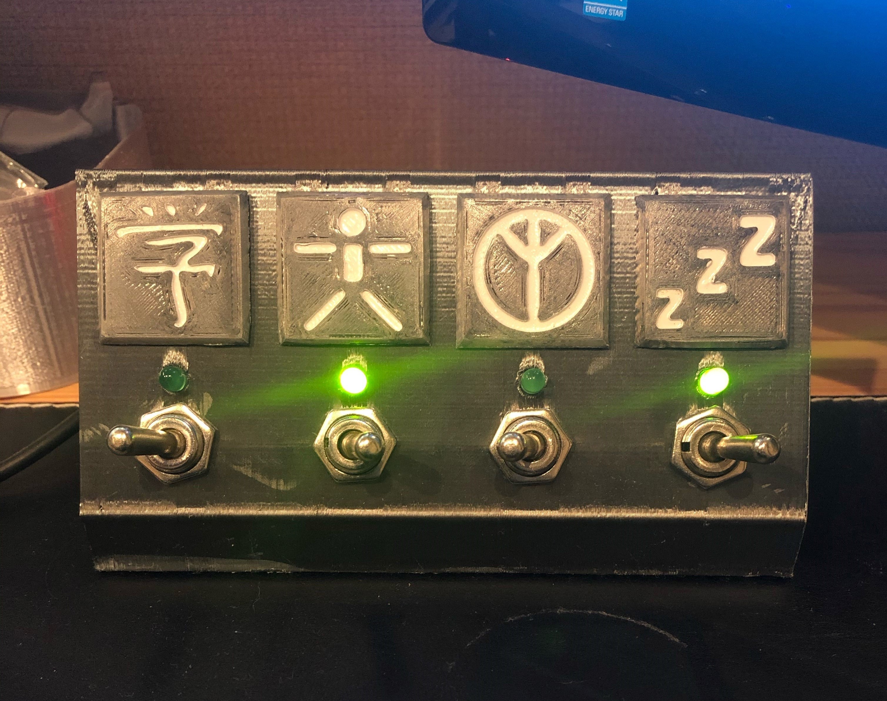

# To-do-board
A 3D-printed tactile board for daily objectives.

3D models made on Fusion360 and printed in silk black PLA.
Electronics running on an Arduino Nano-type board. 
Power draw is quite high as is, so I'm running it off a wall USB adapter. 
Slowing down the program to run it off a 9V should be simple enough.

Each task completed turns the respective LED on, and when all are complete the Final Fantasy fanfare plays, with a little light show. 
The LEDs then reset, and the switches reverse direction.
